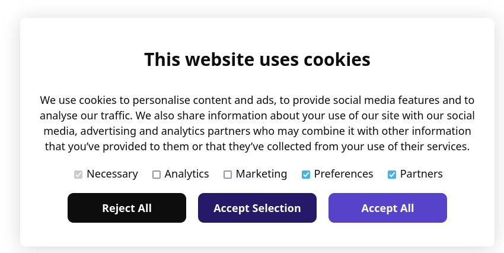

# Cookie Consent Mode V2 For Google Tags
[](#)

Dependency-free cookie consent banner that integrates with Google Consent Mode V2.

What it does:
- Initializes a conservative consent default before tags run.
- Persists user choices in `localStorage` (`consentMode`).
- Applies stored consent on subsequent visits.
- Supports Do Not Track (`navigator.doNotTrack`) and Global Privacy Control (`navigator.globalPrivacyControl`).
- Exposes a small public API (`window.cookieconsent`).
- Supports optional region-scoped default consent behavior.
- Loads GTM automatically after consent boot when `gtmId` is configured.
- Skips GTM loading when no GTM ID is configured.

## Quick Start

1. Include `cookieconsent.css`.
2. Define `window.cookieconsentConfig = { gtmId: 'GTM-XXXXXXX' }` **before** `cookieconsent.js`.
3. Include `cookieconsent.js` in `<head>` (not deferred).
4. Add a `.cookie-consent-banner-open` element anywhere in the page.
5. Enable Consent Mode in GTM and align tag consent requirements.

Minimal example:

```html
<link rel="stylesheet" href="cookieconsent.css" />
<script>
  // GTM will load automatically when consent setup is ready.
  window.cookieconsentConfig = { gtmId: 'GTM-XXXXXXX' };
</script>
<script src="cookieconsent.js"></script>
```

## Load Order

Recommended order in `<head>`:
1. `cookieconsent.css`
2. `window.cookieconsentConfig = { gtmId: ... }`
3. `cookieconsent.js`
4. Other analytics/marketing scripts only if they are also consent-aware

Why: this guarantees consent defaults are available before GTM/tag execution.

## Region Configuration

In `cookieconsent.js`:
- `USE_REGION_LIST = false`: default-deny is applied globally.
- `USE_REGION_LIST = true`: default-deny is scoped to `CONSENT_REGION_LIST`.

Update `CONSENT_REGION_LIST` to match your legal/compliance policy.

## GTM Configuration

Set either:
- `window.cookieconsentConfig = { gtmId: 'GTM-XXXXXXX' }`
- `window.COOKIECONSENT_GTM_ID = 'GTM-XXXXXXX'`

`cookieconsent.js` loads GTM once consent defaults/stored state have been applied.
If neither value is set, GTM is not loaded by this script.

Copy/paste examples:

```html
<script>
  window.cookieconsentConfig = { gtmId: 'GTM-XXXXXXX' };
</script>
```

```html
<script>
  window.COOKIECONSENT_GTM_ID = 'GTM-XXXXXXX';
</script>
```

## Public API

`window.cookieconsent.show()`
- Opens the banner.

`window.cookieconsent.hide()`
- Hides the banner.

`window.cookieconsent.setConsent(selection)`
- Programmatically sets consent.

`selection` shape:

```js
{
  necessary: true,
  analytics: true | false,
  preferences: true | false,
  marketing: true | false,
  partners: true | false
}
```

## Consent Mapping

Selections are mapped to Google Consent Mode keys:
- `marketing` -> `ad_storage`, `ad_user_data`
- `analytics` -> `analytics_storage`
- `partners` -> `ad_personalization`
- `preferences` -> `personalization_storage`
- `necessary` -> `functionality_storage`, `security_storage`

DNT/GPC can force denial for related fields.

## Storage

Consent is saved as JSON in:
- `localStorage['consentMode']`

## Testing Checklist

1. Clear `localStorage['consentMode']` and reload.
2. Confirm banner appears.
3. Make each choice (accept all, reject all, accept selection).
4. Verify `localStorage['consentMode']` updates correctly.
5. Verify GTM loads after consent boot (single script injection).
6. Verify reopening banner with `.cookie-consent-banner-open`.

## DevTools Verification

Quick checks in browser devtools:

```js
// Confirm stored consent state:
localStorage.getItem('consentMode')

// Confirm GTM script injected by cookieconsent.js:
document.querySelector('script[data-gtm-loader]')
```

## Common Mistakes

1. Loading `cookieconsent.js` after GTM or other trackers.
2. Defining GTM ID config after loading `cookieconsent.js`.
3. Forgetting to set either `window.cookieconsentConfig.gtmId` or `window.COOKIECONSENT_GTM_ID`.
4. Assuming region list values are legally complete without compliance review.

## Troubleshooting

- Banner does not appear:
  - Check whether `localStorage['consentMode']` already exists.
  - Call `window.cookieconsent.show()` manually to verify rendering.
- GTM does not load:
  - Check console warning for missing GTM ID.
  - Confirm `window.cookieconsentConfig.gtmId` (or `window.COOKIECONSENT_GTM_ID`) is defined before `cookieconsent.js`.
  - Confirm no CSP rule blocks `https://www.googletagmanager.com`.

## Compliance Note

This implementation provides technical controls for consent signaling and regional scoping.
It is not legal advice. Validate region strategy, defaults, and tagging behavior with legal/compliance stakeholders.

Tip: `index.html` in this repo demonstrates the config-based flow.


